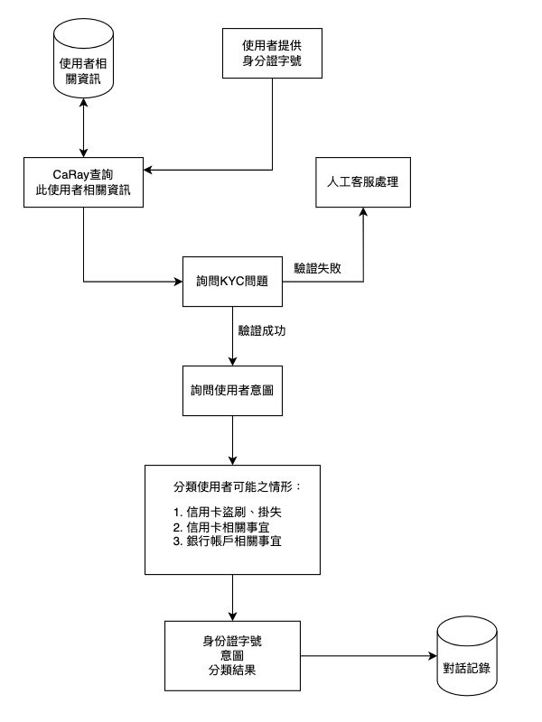
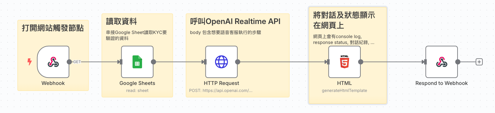
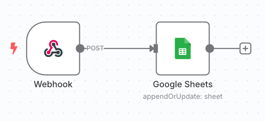

# 即時語音客服 CaRay (Real-time Voice Customer Service CaRay)

CaRay 是一個基於 OpenAI Realtime API 與 n8n 打造的即時語音客服專案。它模擬一位國泰銀行的語音客服專員，能夠與使用者進行即時語音對話，執行身份驗證 (KYC)，理解使用者意圖，並將相關資訊記錄下來。

---

## ✨ 專案特色

-   **即時語音互動**: 使用 OpenAI Realtime API 實現低延遲的語音對話，提供流暢的互動體驗。
-   **結構化對話流程**: 透過精確定義的 `Conversation States`，規範客服的對話步驟、應對方式及不同階段間的轉場條件。
-   **智慧 Function Calling**: AI 能在對話中判斷何時需要外部工具支援，並主動請求呼叫特定功能 (Function)，例如查詢 KYC 資料庫或儲存對話記錄。
-   **n8n 自動化中樞**: 利用 n8n 的視覺化流程編輯器，搭建後端邏輯，包含 API 串接、資料處理及前端網頁服務的提供。
-   **前端互動介面**: 提供一個簡潔的 HTML/JavaScript 頁面，使用者可透過麥克風與 CaRay 進行語音互動，並即時查看對話記錄與系統運行狀態。
-   **資料自動記錄**: 將重要的對話資訊，如使用者的身分證字號、提出的業務需求及其分類，自動化地儲存至 Google Sheets 以供後續追蹤或分析。

---

## 🏗️ 專案架構與運作流程

本專案主要由兩個 n8n workflows (主流程與儲存流程) 和一個前端 HTML 頁面構成，協同完成即時語音客服的功能。

### 🔁 整體流程圖

>   
> *(請將圖片上傳至您的 GitHub Repo 並更新此處連結)*

### 操作流程說明

1.  **使用者 (User)**：透過瀏覽器開啟由 n8n "Main Flow" Webhook 提供的網頁服務。
2.  **前端 (Client-Side HTML/JavaScript)**：
    *   初始化 WebRTC，並請求使用者授予麥克風使用權限。
    *   與 OpenAI Realtime API 建立安全的 WebRTC 連線。
    *   當使用者按住空白鍵說話時，擷取語音輸入並即時串流至 OpenAI API。
    *   接收來自 OpenAI API 的回應，包含 AI 的語音輸出、文字轉錄稿，或是 Function Calling 的請求。
    *   若接收到 Function Calling 請求 (例如 AI 需要查詢 KYC 資料)，前端會執行預先定義好的 JavaScript 函式。
    *   將 Function 的執行結果回傳給 OpenAI API，AI 會根據此結果繼續對話。
    *   在網頁上同步顯示對話內容及系統狀態日誌。
3.  **n8n - Main Flow (主要自動化流程)**：
    *   由前端的初始頁面請求觸發 (Webhook)。
    *   從 Google Sheets 讀取預存的 KYC 驗證資料。
    *   向 OpenAI Realtime API 發起請求，建立一個新的對話會話 (`session`)，並在請求中傳入 AI 的行為指令 (`instructions`)、對話狀態 (`Conversation States`) 及可用的工具 (`tools`)。
    *   將包含前端互動邏輯的 HTML 頁面 (已注入 OpenAI `client_secret` 和 KYC 數據) 回傳給使用者的瀏覽器。
4.  **n8n - Save Flow (資料儲存流程)**：
    *   提供一個獨立的 Webhook API 端點 (例如 `/webhook/SaveData`)。
    *   當前端的 `SaveData` Function 被觸發時 (AI 決定儲存資訊)，前端會呼叫此 API。
    *   此流程接收到前端傳來的資料後，將其寫入指定的 Google Sheet 中進行儲存。

---

## 🧠 Function Calling 原理

在此專案中，AI (CaRay) 並非直接執行程式碼或 API，而是在對話過程中，根據其被賦予的任務和上下文理解，判斷何時需要外部資訊或操作來輔助完成任務。

當 AI 判斷需要使用工具時，OpenAI Realtime API 會回傳一個特定類型的事件 (例如 `type = "response.function_call_arguments.done"`)，其中包含了它希望呼叫的工具名稱 (如 `KYC_info_retriever`) 和所需的參數。

前端的 JavaScript 程式會監聽並攔截這個事件。一旦偵測到 Function Calling 請求，前端會執行以下步驟：

1.  **解析請求**：從事件中提取工具名稱和參數。
2.  **執行對應功能**：根據工具名稱，執行預先在 JavaScript 中定義好的函式。這些函式可能包括：
    *   **查詢 KYC 資料**：在本專案中，`KYC_info_retriever` 會在前端已有的數據 (從 n8n 初始載入) 中查找資訊。
    *   **儲存對話資訊**：`SaveData` 函式會呼叫 "n8n - Save Flow" 的 API，將資料傳送至後端儲存。
    *   **結束對話**：`EndSession` 函式會關閉相關的 WebRTC 連線並釋放資源。
3.  **回傳結果**：將函式執行的結果 (無論成功或失敗) 封裝成 `tool_output` 的格式，透過 WebRTC DataChannel 回傳給 OpenAI API。
4.  **AI 繼續對話**：AI 接收到 `tool_output` 後，會整合這個新資訊與先前的對話上下文，生成下一步的回應。

這種機制使得 AI 能夠與外部系統或數據源進行間接互動，擴展了其能力邊界。

> 📖 參考資料：[OpenAI Realtime Conversations - Function Calling](https://platform.openai.com/docs/guides/realtime-conversations#function-calling)

---

## 🔧 n8n 實作細節

專案的核心自動化邏輯是透過兩個 n8n workflow 實現的：一個主要的對話流程 (Main Flow) 和一個用於儲存資料的輔助流程 (Save Flow)。

### 🔹 Main Flow

>   
> *(請將圖片上傳至您的 GitHub Repo 並更新此處連結)*

此流程是整個即時語音客服的核心，負責處理與 OpenAI Realtime API 的初始設定、提供前端互動介面，並管理整個對話的生命週期。

#### 📌 初始觸發與資料讀取 (Webhook & Google Sheets Node)

*   **流程觸發**: 當使用者透過瀏覽器訪問指定的 Webhook URL 時，此流程被觸發。
*   **KYC 資料準備**: 流程開始時，會透過 Google Sheets 節點從預先配置好的 Google Sheet 中讀取 KYC (客戶身份驗證) 所需的基礎資料。這些資料稍後會被注入到前端頁面供 `KYC_info_retriever` function 使用。

#### 🔗 建立 Realtime 會話 (HTTP Request Node)

*   **API 呼叫**: 此節點向 OpenAI Realtime API 的 `/v1/realtime/sessions` 端點發起 POST 請求，以建立一個新的即時對話會話。
*   **關鍵配置 (`jsonBody`)**:
    *   `instructions`: 詳細定義 AI (CaRay) 的人格、任務、語氣，以及最重要的 `Conversation States` (結構化對話步驟與轉場條件)。
    *   `tools`: 定義 AI 可呼叫的工具 (`KYC_info_retriever`, `SaveData`, `EndSession`)，並提供清晰的描述以助 AI 判斷。
    *   其他參數如 `model`, `voice`, `input_audio_transcription` 等也在此設定。

#### 🖥️ 前端頁面注入與回傳 (HTML Node & Respond to Webhook Node)

*   **前端邏輯承載 (HTML Node)**: 此節點包含完整的 HTML、CSS 及 JavaScript 程式碼，構成使用者互動介面。
    *   JavaScript 負責 WebRTC 連線、麥克風控制、與 OpenAI API 的事件處理 (包括 Function Call 的攔截與執行)、以及 UI 更新。
    *   重要的動態數據注入：
        *   `{{ $json.client_secret.value }}`: 從 HTTP Request 節點回應中獲取的 OpenAI `client_secret`，用於前端建立安全連線。
        *   `{{ JSON.stringify($("Google Sheets").all()) }}`: 將從 Google Sheets 節點讀取的 KYC 資料陣列轉換為 JSON 字串，嵌入到 JavaScript 中，供 `fakeKYCFunction` 使用。
*   **頁面回傳 (Respond to Webhook Node)**: 將組譯好的 HTML 內容回傳給使用者的瀏覽器。

### 🔹 Save Flow

>   
> *(請將圖片上傳至您的 GitHub Repo 並更新此處連結)*

此流程作為一個簡單的後端 API，用於接收並儲存由 Main Flow 前端 `SaveData` function 傳來的對話資訊。

#### 📥 接收資料 (Webhook Node)

*   **API 端點**: 設定一個 Webhook 路徑 (例如 `SaveData`)，並監聽 HTTP POST 請求。
*   **資料來源**: 從請求的 Body 中獲取 JSON 格式的資料 (如 `id`, `intention`, `intention_classified`)。

#### 📝 寫入 Google Sheets (Google Sheets Node)

*   **資料持久化**: 將接收到的資料映射到 Google Sheet 的相應欄位，並執行附加 (append) 或更新 (update) 操作，將對話記錄儲存起來。

---
